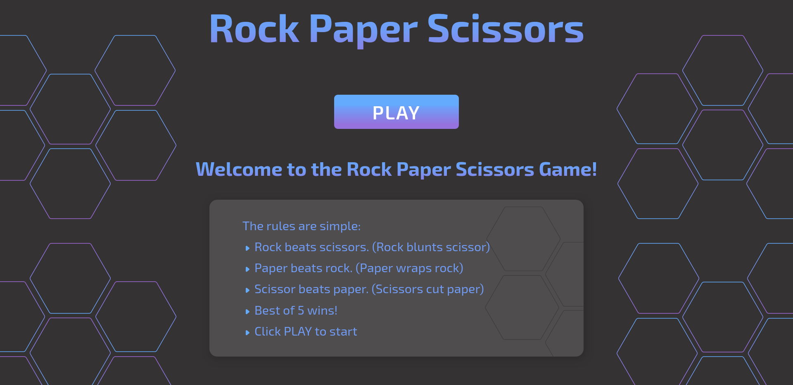
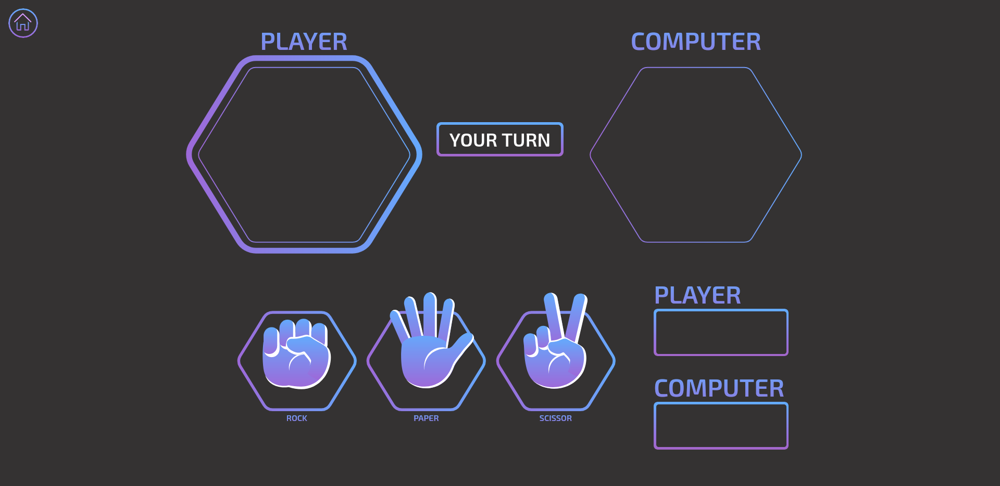
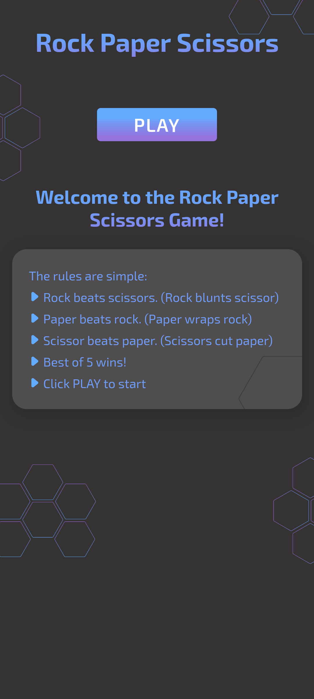
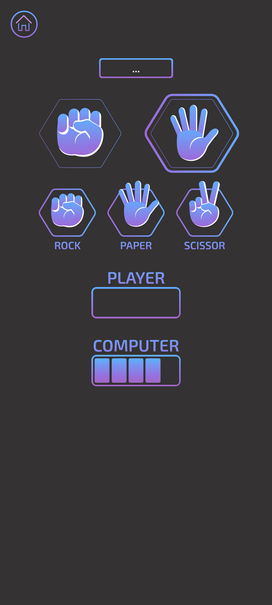

# Rock Paper Scissor

A rock paper scissor website to practice HTML, CSS and Javascript.

## Note

This was my first attempt to make a responsive website and I think it turned out great for first attempt.

## Preview

### Desktop

## Mobile

